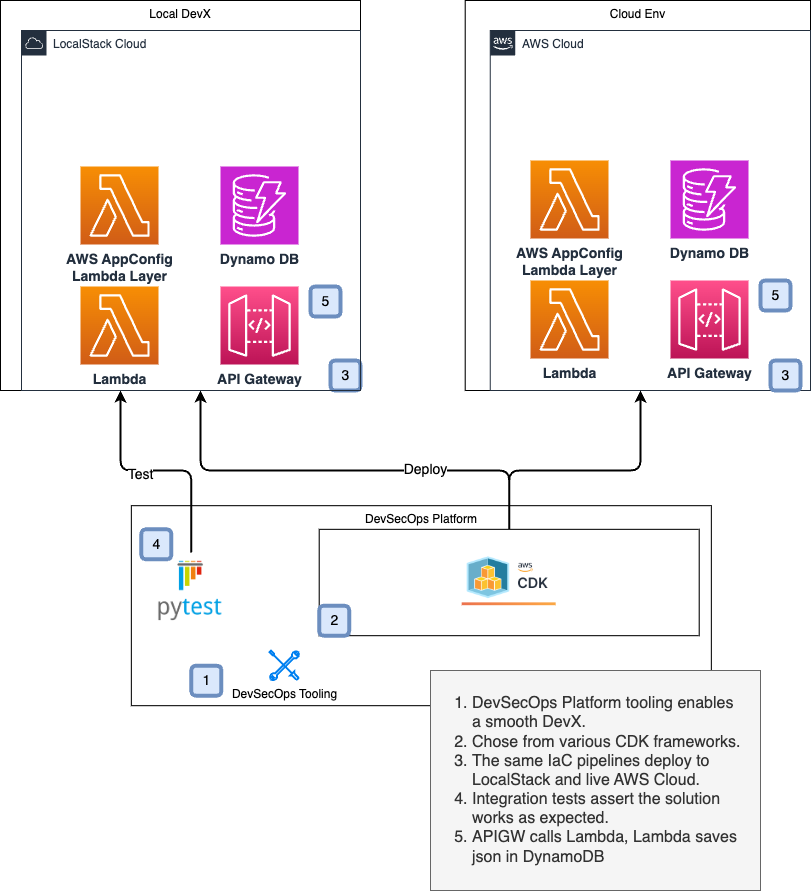

# Lambda DynamoDB APIGW solution with integration test



# Overview

- IaC in AWS CDK
- DevOps tooling and makefile configuration
- Solution deploys to LocalStack and includes an integration test
- Solution deploys to AWS using the same IaC

## LocalStack Requirements

- LocalStack Pro subscription

# Deploy to LocalStack

## Deploy with AWS CDK to LocalStack

### Bootstrap AWS CDK Stacks on LocalStack

You need to do this once.

```shell
make local-awscdk-bootstrap
```

### Deploy App Stack on LocalStack

This will deploy the resources.

```shell
make local-awscdk-deploy
```

### Curl APIGW Url

```shell
make local-awscdk-invoke
```

### Run test

This will run the integration test asserting the Lambda AppConfig and DynamoDB integrations work.

```shell
make local-awscdk-test
```

## Deploy and Test in Integration Environment
To deploy and test in an integration environment, change all of the `local-<command>` commands above to `integ-<command>`.

### Cleanup and restart LocalStack

```shell
make local-awscdk-clean restart-ls
```

# Deploy to AWS

We use the same IaC pipelines to deploy to AWS! This is a very important point that LocalStack enables teams
to test their IaC pipelines locally before ever deploying them to a live AWS environment.

Do this from your host machine. Not inside the GDC.

Install AWS `cdk`

```shell
npm install -g aws-cdk
```

## Set Live AWS Credentials

However you set your credentials in your terminal, do it now.

### Deploy the AWS CDK IaC App Stack

Bootstrap the account. Only need to do this once per account/region.

```shell
make sbx-awscdk-bootstrap
```

This will deploy the resources.

```shell
make sbx-awscdk-deploy
```

### Invoke the Lambda in AWS

```shell
make sbx-awscdk-invoke
```

### Destroy the CDK Stack in AWS

```shell
make sbx-awscdk-destroy
```
